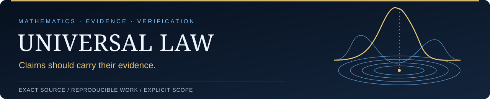

[](https://d6g8k5htny-coder.github.io/main/site/)

# Universal Law

**Gaussian random fields, persistent homology, and reproducible multi-model mathematical research.**


[RESEARCH HOME](https://github.com/d6g8k5htny-coder/main)
· [PROOF VAULT](https://github.com/d6g8k5htny-coder/Math-)
· [EXACT-SOURCE SEARCH](https://github.com/d6g8k5htny-coder/query-)
· [FEDERATION MAP](https://github.com/d6g8k5htny-coder/Universal-Law-Workspace)
· [VERIFICATION MUSEUM](https://d6g8k5htny-coder.github.io/main/site/museum.html)

[](https://github.com/d6g8k5htny-coder/main/actions/workflows/workspace-landing.yml)
[](https://github.com/d6g8k5htny-coder/main/actions/workflows/navigation.yml)
[](LICENSE)

This is the **single public front door** for the Universal Law research program. The project studies persistence lifetimes and critical-point geometry of Gaussian random fields, together with exact/reproducible computational methods and a fail-closed review workflow. Proofs, code, reviews, and source identities live in several focused repositories, but readers should start here.

## Public research shop

[Open the live research shop](https://d6g8k5htny-coder.github.io/main/site/) for the status board, pinned SIDE24 coefficient viewer, searchable full-text catalog, and contribution route. The [shop guide](docs/site/README.md) explains its sources and limits. The [SIDE24 notebook](docs/notebooks/README.md) is also readable on GitHub and runnable in Colab. [Grab a public task](https://github.com/d6g8k5htny-coder/main/issues?q=is%3Aissue+is%3Aopen+label%3Agood-first-task), follow the [Public contributions board](https://github.com/users/d6g8k5htny-coder/projects/1/views/1), or [submit an incoming result PR](CONTRIBUTING.md).

The static app is live on main's GitHub Pages, published from `main` / `docs`. See the [deployment and review settings record](docs/PUBLIC_SHOP_SETUP.md). All views preserve scoped ACCEPT, AMEND/open, and engineering-only distinctions. They cannot change scientific status.

**Quick browser demo:** [Open the SIDE24 notebook in Colab](https://colab.research.google.com/github/d6g8k5htny-coder/main/blob/main/docs/notebooks/SIDE24_PUBLIC_COEFFICIENTS.ipynb), then choose **Runtime → Run all**. Read the verified source identity and exact coefficient endpoints for dimensions 2 and 3; the optional chart is **NON-CERTIFYING**. You need no local checkout or installation. The [notebook guide](docs/notebooks/README.md) also explains local setup and dependencies.

## Public source path

For a stranger who wants the landed mathematics rather than the live agent queue, use this order:

1. **Proof index:** [Math- `PROOF_INDEX.md` at `d6628da09384728992dcbe6e921cc28ba85aebb0`](https://github.com/d6g8k5htny-coder/Math-/blob/d6628da09384728992dcbe6e921cc28ba85aebb0/PROOF_INDEX.md)
2. **Human status map:** [`STATUS.md`](STATUS.md)
3. **Pinned Math checkout:**
   ```sh
   git clone https://github.com/d6g8k5htny-coder/Math-.git Math-
   git -C Math- checkout --detach d6628da09384728992dcbe6e921cc28ba85aebb0
   ```
4. **Pinned query checkout:**
   ```sh
   git clone https://github.com/d6g8k5htny-coder/query-.git query-
   git -C query- checkout --detach c88768bb11efd1f7d6bda188f13064bedec54a06
   python -B -S -m unittest discover -s query-/tests -p 'test_*.py' -v
   ```

For byte identity, use the [public source inventory](docs/public-math/sources.json): its 2,138 frozen source rows are split across the linked JSON pages, and every row records a GitHub repository, path, 40-character commit, Git blob, byte count, and SHA-256. The inventory excludes sandbox, quarantine, and personal paths and is an availability/custody index, not an acceptance register.

**Recovered historical falsifiers:** the [STAGE_E source packet](https://github.com/d6g8k5htny-coder/Math-/blob/a2c3657c3115853a9bd8642b78c3f9ca0bbc59d1/imports/upper2d_stage_e_20260926/README.md) preserves 11 exact files, a reproduced finite H4-JC counterexample, and a source-bound review of numerical defects. Its original certification labels are historical text; the packet does not establish Gaussian continuum or Palm claims. This additive recovery is separate from the frozen inventory above.

The companion [H5 ledger recovery and loader audit](https://github.com/d6g8k5htny-coder/Math-/blob/f6a63031547c2433267b05a676d74fd54fb4412d/imports/upper2d_h5_ledgers_20260926/README.md) supplies 48 unchanged data files previously missing from that packet. It traces overwritten and failed probe records and documents a missing `e-35` exponent in one historical rim-script constant. Custody and input selection are verified; the numerical hunt and mathematical bounds remain unverified.

**Open draft PRs are visible research/review material, but they are not default-branch mathematics.** Do not treat an AMEND draft, review branch, or custody PR as landed proof merely because GitHub can display it.

## Current status

| Class | Current objects |
|---|---|
| **ACCEPT — scoped** | D2 lifetime remainder; D3 SIDE24 coefficient calculation; D4 fixed-remote RN count theorem; D6/P15 full-price theorem at its stated realized-family scope |
| **AMEND / open** | D1 parent quantitative Theorem-A chain; D5 pin-neighborhood / microdisk bound; SARD-G A1/A6 |
| **Engineering only** | `query-` package, Universal-Law-Workspace federation map, CI/reproducibility infrastructure |

**ACCEPT — scoped** means a source-bound technical review accepted the stated object at its declared hypotheses. It does **not** silently accept imported parents, broaden scope, close prize problems, or turn CI into mathematical evidence.

Read the exact scope, sources, and review links in **[STATUS.md](STATUS.md)**.

## Run one thing

A clean public checkout of the read-only query package needs no private Drive access and no dependency install for its test suite:

```sh
git clone https://github.com/d6g8k5htny-coder/query-.git
cd query-
python -B -S -m unittest discover -s tests -p 'test_*.py' -v
```

That command is also the canonical package-control step in the `query-` GitHub Actions workflow. Passing it verifies the package controls; it does not verify a theorem.

## Where things live

| Repository | Purpose |
|---|---|
| **[main](https://github.com/d6g8k5htny-coder/main)** | This front door: status, public reading path, review discussions, integration |
| **[Math-](https://github.com/d6g8k5htny-coder/Math-)** | Proofs, calculations, mathematical tests, proof index |
| **[query-](https://github.com/d6g8k5htny-coder/query-)** | Read-only exact-source lookup and local verification |
| **[meta-framework](https://github.com/d6g8k5htny-coder/meta-framework)** | Machine-readable source identities and repository routing |
| **[Universal-Law-Workspace](https://github.com/d6g8k5htny-coder/Universal-Law-Workspace)** | Supporting federation/navigation map; not a second research home or status authority |

For full proof texts, use **[Public mathematics](docs/PUBLIC_MATHEMATICS.md)**. For detailed reading order and open work, use the **[Research guide](docs/RESEARCH_INDEX.md)**.

## Evidence rules

- Exact source identities are pinned by Git object and/or SHA-256 where relevant.
- Numerical or floating-point work is labeled non-certifying when it is not a proof.
- Independent review is recorded separately from same-author checks.
- A merge, green CI run, hash match, publication, or model agreement does not promote mathematical status.
- A kernel-checked Lean lemma verifies exactly its own statement; it does not verify the analytic argument around it or promote a Layer 0 status.

## Verification stack

| Layer | What it checks | Where |
|---|---|---|
| **Layer 0 — provenance, scope, review** | Exact bytes (SHA-256, Git blobs), declared scope and "does not claim" statements, source-bound nonauthor review, fail-closed intake and landing gates | [`STATUS.md`](STATUS.md), [Math- proof index](https://github.com/d6g8k5htny-coder/Math-/blob/d6628da09384728992dcbe6e921cc28ba85aebb0/PROOF_INDEX.md), [public inventory](docs/public-math/sources.json), [museum](https://d6g8k5htny-coder.github.io/main/site/museum.html) |
| **Layer 1 — formal (Lean 4)** | Statements and proofs checked by the Lean kernel, bound by hash to exact Layer 0 bytes, with per-package manifests (`proved` at source, `kernel-checked` only in a trusted run receipt) and an independent statement-alignment review | [Guide](docs/FORMAL_VERIFICATION.md), [Math- pilot](https://github.com/d6g8k5htny-coder/Math-/tree/cc2989c1280f4f227d0c6aa30c8841d6ba01e46e/formal), [`formal/README.md`](formal/README.md), [glossary](formal/GLOSSARY.md), [review lane](formal/REVIEW_LANE.md) |

Two packages share one contract: the Math- pilot (13 GP-FOR-192 scalar companions, Lean + Mathlib) and the main-side package in `formal/` (31 exact integer/rational facts from the SIDE24 coefficient note, core Lean, zero axioms). The coefficient bound itself and every analytic step are outside both packages and remain Layer 0 prose; see [`formal/SCOPE.md`](formal/SCOPE.md) and the [rollout record](docs/FORMAL_VERIFICATION_ROLLOUT_20260927.md) for what changed, why, and what each repository is asked to do next.

```sh
python3 tools/formal_gate_check.py                 # source-only: hashes, inventory, anchors
python3 tools/formal_gate_check.py --run-lean      # build, leanchecker, axiom audit, controls, receipt (needs elan)
python3 -B -S -m unittest tests.test_formal_gate -v
```

## Research still in progress

The parent D1 quantitative selection chain, pin-neighborhood/microdisk work, SARD-G execution details, and other explicitly open regional obligations remain visible rather than being flattened into a solved-program claim. See [STATUS.md](STATUS.md) and the [public proof catalog](docs/PUBLIC_MATHEMATICS.md).

## Contributing

Start with [CONTRIBUTING.md](CONTRIBUTING.md) and [AGENTS.md](AGENTS.md). New work should attach to an existing mathematical or engineering lane instead of creating a new repository or duplicate status surface.

## License and citation

Released under the [MIT License](LICENSE). Citation metadata is in [CITATION.cff](CITATION.cff).

## Verification museum

Open the [claim cards and source-bound exhibits](https://d6g8k5htny-coder.github.io/main/site/museum.html) for quoted scopes, proof/review identities, and replay links. The [packet list](https://d6g8k5htny-coder.github.io/main/site/museum.html#packets) shows submissions present in its pinned default-branch snapshot; packets are not STATUS. The museum uses the Math checkout and query checkout pinned above. [Display documentation](docs/site/README.md) explains its snapshots and limits.
