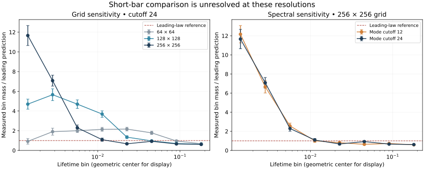

# What the first periodic H₀ pilot shows

**The comparison is inconclusive at the tested resolutions.** The short-bar counts are strongly grid-sensitive. This pilot supplies reproducible observations and exposes a numerical bottleneck; it neither confirms the asymptotic coefficient nor refutes the continuum theorem.

The fixed design uses 32 independent planar fields on a side-24 torus, each evaluated on grids 64², 128² and 256² with square Fourier cutoffs 12 and 24. These are 192 coupled evaluations, **not 192 independent fields**. All predeclared bins and configurations are retained. There was no fitted slope, chosen confirmation window or discarded zero-count realization.

Error bars are one standard error of the mean across independent fields, divided by the integrated leading prediction. They are descriptive marginal sampling errors, not simultaneous confidence bands, grid-error bounds or theorem error bars. Plot centers are display positions only; predictions integrate over each whole bin.

## Counts and the scale of the grid effect

The table uses spectral cutoff 24. Counts are totals across the same 32 fields. The final column is the finest-grid mass divided by `(3c/2)(b^(2/3)−a^(2/3))`, with `c≈0.07340691930603427` from the separate source coefficient enclosure. This floating-point comparison does not preserve that enclosure's twenty-digit precision.

| Lifetime bin | 64² count | 128² count | 256² count | 256² ratio ± one SE |
|---|---:|---:|---:|---:|
| [0.001, 0.002) | 11 | 56 | 139 | 11.659 ± 1.013 |
| [0.002, 0.004) | 36 | 107 | 134 | 7.081 ± 0.555 |
| [0.004, 0.008) | 60 | 141 | 69 | 2.297 ± 0.283 |
| [0.008, 0.016) | 102 | 176 | 52 | 1.090 ± 0.162 |
| [0.016, 0.032) | 164 | 102 | 51 | 0.674 ± 0.089 |
| [0.032, 0.064) | 214 | 116 | 111 | 0.924 ± 0.087 |
| [0.064, 0.128) | 182 | 133 | 126 | 0.661 ± 0.057 |
| [0.128, 0.256) | 205 | 189 | 185 | 0.611 ± 0.047 |

In the first bin, refinement changes the count from 11 to 56 to 139. For the same fields, the 128²→256² difference in per-area mass is about 0.004503 with a paired standard error of 0.000731. Sampling more fields at the same grids would not remove this observed resolution sensitivity. The larger bins appear less grid-sensitive in this pilot, but their finite lifetimes are not known to lie inside the theorem's unevaluated asymptotic window.

The fixed cutoff-12 series retains about 0.9979384 of the target variance; its omitted squared second-derivative-frequency sum through mode64 is about 0.3976. Cutoff24 leaves only about 2.52×10⁻¹⁰ omitted variance through mode64, but this is a floating-point spectral diagnostic, not a uniform field approximation certificate. Low variance error alone can conceal appreciable derivative error. Both cutoffs show short-bin grid drift.

## What was checked

GUDHI's actual periodic vertex filtration agrees with an independent descending union-find oracle on small known and random/tied landscapes. The tests distinguish periodic gluing, elder selection, positive finite versus essential bars, translations, amplitude scaling, half-open bins and volume normalization. A deterministic basis-response covariance check of the FFT agrees with a separately derived finite cosine sum; wrong spectrum and missing conjugate variance mutants fail. The reporting audit recomputes every saved count and summary from retained intervals, every calibration aggregate from retained samples, and the covariance targets, spectral diagnostics and deterministic controls.

A separate 1,024-field calibration sample gives standardized product-mean discrepancies -0.319, 0.210, 0.090, 1.176 at the four declared lags. These are diagnostics with marginal estimated standard errors, not a multiple-testing guarantee. Every calibration point sample is retained.

## Next research decision

Do not fit the smallest bins yet. First study spatial interpolation/filtration approximation and identify a lifetime range stable under further coupled refinement; then predeclare a separate held-out confirmation design. A certified comparison additionally needs a quantitative continuum error bound and usable remainder constants/range. Near-diagonal unmatched features and bin crossings must be accounted for. This pilot contains no typed-contact estimator, so it cannot measure a candidate-minus-elder defect.

## Exact output and reproduction

All finite positive intervals, essential births, zero-length counts, per-realization bins, paired differences and calibration samples are in [observations.json](observations.json). [RUN.json](RUN.json) records the executed code/config identities, runtime and versions. Follow the [reproduction instructions](../../README.md). Original mathematical sources remain in the [source manifest](../../../../docs/research-translation/20260930/SOURCES.json); this run changes no scientific status.

Observation SHA256: `fa310ea8a259fbf58413bd49713260c7b7c73f9c3c9387426c10947e487000b4`.
