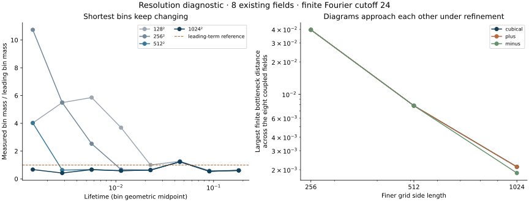

# What finer grids change

**The shortest bins remain unresolved.** The added grids and diagonal controls show substantial reduction of the discretization effect, while several larger bins stabilize. This is not a confirmation or refutation of the continuum coefficient.

Eight seeds (34000–34007) were selected as the first eight original pilot fields before this follow-up was run. Four nested grids and three filtrations give 96 coupled evaluations, not 96 independent fields. Every original bin and every positive finite interval is retained in [observations.json](observations.json); [RUN.json](RUN.json) records the actual execution.

## Cubical counts across the four grids

| Lifetime bin | 128² | 256² | 512² | 1024² |
|---|---:|---:|---:|---:|
| [0.001, 0.002) | 12 | 32 | 12 | 2 |
| [0.002, 0.004) | 26 | 26 | 3 | 2 |
| [0.004, 0.008) | 44 | 19 | 5 | 5 |
| [0.008, 0.016) | 44 | 8 | 7 | 7 |
| [0.016, 0.032) | 19 | 12 | 12 | 12 |
| [0.032, 0.064) | 38 | 37 | 37 | 37 |
| [0.064, 0.128) | 28 | 26 | 26 | 26 |
| [0.128, 0.256) | 46 | 46 | 46 | 46 |

The first bin rises and then falls under refinement. Counts need not vary monotonically with resolution. A leading-term ratio close to one on one grid is therefore not reliable evidence of the asymptotic law.

## Finest-grid comparison

| Lifetime bin | Cubical | PL + diagonal | PL − diagonal | Cubical mean mass ± one field-level SE |
|---|---:|---:|---:|---:|
| [0.001, 0.002) | 2 | 3 | 2 | 0.000434028 ± 0.000284 |
| [0.002, 0.004) | 2 | 1 | 2 | 0.000434028 ± 0.000284 |
| [0.004, 0.008) | 5 | 5 | 5 | 0.00108507 ± 0.000457 |
| [0.008, 0.016) | 7 | 7 | 7 | 0.0015191 ± 0.000217 |
| [0.016, 0.032) | 12 | 12 | 12 | 0.00260417 ± 0.000568 |
| [0.032, 0.064) | 37 | 37 | 37 | 0.00802951 ± 0.000318 |
| [0.064, 0.128) | 26 | 26 | 26 | 0.00564236 ± 0.00122 |
| [0.128, 0.256) | 46 | 46 | 46 | 0.00998264 ± 0.00117 |

All three methods agree in aggregate for bins starting at 0.004 at 1024². Several such counts already agree at 512², but this is eight-field empirical agreement, not a certified bin sandwich or an ensemble confidence result. The paired per-field changes are retained; aggregation can conceal compensating changes.

## Distance and error are different quantities

| Comparison | Largest finite-diagram bottleneck distance |
|---|---:|
| Cubical 128² → 256² | 0.039628748 |
| Cubical 256² → 512² | 0.00784240595 |
| Cubical 512² → 1024² | 0.00212639741 |

These are actual GUDHI distances between computed finite diagrams. They do not bound distance to an unknown continuum diagram. Essential classes are retained separately and excluded from these finite-diagram distances.

The [deterministic approximation note](../../APPROXIMATION.md) proves an O(h²) bound for the cubical and triangulated filtrations of a specified smooth finite realization, conditional on certified derivative and nodal-error inputs. The simple floating Fourier-Hessian diagnostic gives finest-grid endpoint-error estimates from 0.00881586 to 0.00972349. These are conservative, not outward-rounded certificates. They cannot certify the shortest bins, and they do not enclose the infinite-field tail.

The next step is to evaluate sharper certified numerical bounds and a valid asymptotic remainder budget. [Confirmation readiness](../../CONFIRMATION_READINESS.md) states what remains missing. No held-out confirmation window or fitted exponent is selected here.

[Reproduce](../../README.md) · [Frozen design](../../REFINEMENT_PROTOCOL.md) · [Earlier pilot](../pilot32/RESULTS.md)
