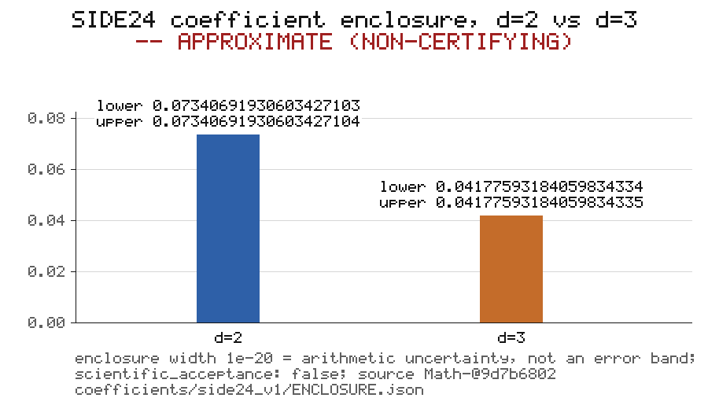

# Public task #141: regenerate the pinned SIDE24 coefficient chart

Scientific effect: **NONE**. Review status: **REVIEW_REQUIRED**. Task:
https://github.com/d6g8k5htny-coder/main/issues/141 (starter type `chart`).
This package is a same-account dry run of the `incoming/` intake lane by
Anthropic/Claude Code and carries zero organizational-independence credit. It
regenerates one clearly labeled approximate comparison chart from already
public, pinned SIDE24 bytes and copies the exact endpoint strings without
re-parsing them through floating point. Nothing in it is a theorem, a bound,
a review of the mathematics, or an acceptance of the source.

## Source identity

| field | value |
|---|---|
| repository | `d6g8k5htny-coder/Math-` |
| commit | `9d7b6802424fb4715b31999066aafca8ee2f3cca` |
| path | `coefficients/side24_v1/ENCLOSURE.json` |
| bytes | 1090 |
| sha256 | `72b6cd92d31394cdaf5da8919a5d548e902228af1f095cc184158a71d8287811` |
| git blob | `57af39a05e14ed0ba8ebc00a9b4aca4dffb067c7` (mode 100644) |

The generator read the bytes with `git show <commit>:<path>` from a local
clone of Math- and checked the byte length (1090), the SHA-256 and the Git
blob identity (`sha1("blob 1090\0" + bytes)`) **before** parsing. A mismatch
refuses with exit code 2 and writes nothing. Parsing is strict: duplicate
keys, `NaN`/`Infinity` and float literals are refused. The generator also
refuses, with exit code 2, unless `scientific_acceptance` is exactly JSON
`false`; that value is copied into `output.json`, not decided here.

Two further pinned files at the same commit are listed in `IDENTITY.json`.
They were used only for the independent regeneration below and are not part
of this package, because the intake lane refuses scripts:

| path | bytes | sha256 | git blob |
|---|---|---|---|
| `coefficients/side24_v1/coefficient.py` | 8073 | `03ae6d0f15160cb681f9bbb19a84dc861c3a0db3e881291ea621061cc90c86ab` | `c2d3ff339f2b9953ec08e676240cdc5edcb17a3e` |
| `coefficients/side24_v1/test_coefficient.py` | 4762 | `81689b5394e2e949058929570ec072ccb1d4fe93cd0d36a4b258431547d02dd3` | `fa9beaab7d6fcb4f0a0c5a91c6d80b455c98a912` |

## Exact endpoints

Copied verbatim from the pinned source; the same strings appear in
`output.json`. No endpoint was converted to a float and printed back.

| dimension | lower | upper | exact width `upper - lower` | cone moment |
|---|---|---|---|---|
| 2 | `0.07340691930603427103` | `0.07340691930603427104` | `1/100000000000000000000` | `4/3` |
| 3 | `0.04177593184059834334` | `0.04177593184059834335` | `1/100000000000000000000` | `29/6-sqrt(6)` |

The widths are `fractions.Fraction(upper) - fractions.Fraction(lower)`,
exactly 10^-20 in both dimensions: one unit in the last digit of an
outward-rounded 20-digit decimal. Source metadata copied verbatim: object
`SIDE24-COEFFICIENT-D23-20260924-v1`; scope `coefficient of issue63 Eq15.2;
parent theorem unreviewed`; method `outward rational arithmetic; analytic
image and Stirling remainder bounds`; `scientific_acceptance: false`.

## Independent regeneration

The two pinned scripts were copied byte-for-byte from Math-@9d7b6802 into a
scratch directory outside the repository, their SHA-256 digests were checked
against the values above before anything ran, and they were run with the
interpreter `python` (CPython 3.11.15, `/usr/local/bin/python`), stdout and
stderr captured together, with a 15-minute cap that was nowhere near reached.
Each log starts with a `# command: ... ; python: ... ; wall seconds: ... ;
exit: ...` line followed by the verbatim capture; neither log needed
truncation.

| command | wall seconds | exit | log |
|---|---|---|---|
| `python -B -S coefficient.py` | 0.851 | 0 | [regeneration/coefficient_run.txt](regeneration/coefficient_run.txt) |
| `python -B -S -m unittest test_coefficient -v` | 0.979 | 0 | [regeneration/test_run.txt](regeneration/test_run.txt) (30 tests, OK) |

`coefficient.py` prints its report as JSON. The generator parsed that log
(after the `# ` header lines) and compared the four endpoint strings with the
pinned source programmatically: **all four are byte-for-byte equal**, recorded
as `endpoints_reproduced_byte_for_byte: true` in `output.json`. Beyond the
four endpoints, the printed report followed by one newline is byte-identical
to the 1090-byte pinned `ENCLOSURE.json`. So the pinned exact-arithmetic
script, re-run here, reproduced the pinned endpoint strings byte-for-byte.
That is a reproduction of a computation by its own code on another machine;
it is not a review of the derivation, and the source itself says the parent
theorem is unreviewed.

## The chart

`chart_side24_d2_d3.png` (900x520, 8-bit RGB) is **APPROXIMATE** and
**NON-CERTIFYING**. The two bars are the d=2 and d=3 enclosures on a common
axis from 0 to 0.08 with gridlines at 0.02 steps. Each bar height is
`float(lower)` mapped to a pixel row; `float(upper)` lands on the same row.
The exact endpoint strings are printed as text above each bar, glyph by glyph,
so the picture carries the exact values while the bar heights do not. The
enclosure width of 10^-20 is the arithmetic uncertainty of the outward
rounding and is **not** drawn as a finite-radius error band: at this scale it
is invisible, and drawing a visible band would misrepresent it. The image was
rendered by the generator with a standard-library encoder (zlib + struct;
IHDR, one IDAT, IEND; filter byte 0 on every row; no tIME, tEXt or other
ancillary chunks) from a 5x7 bitmap font, so two consecutive runs produce
identical bytes.

## Method and reproducibility

The generator, `regenerate.py`, is not in this package because the intake
lane refuses scripts, and no script text is encoded in any allowed file.
Its identity: 23428 bytes, SHA-256
`226e90bd629affbe35faab97d6df28ce2c6398d55402d502d99e28725df9105e`. It is
Python 3.11 standard library only (`hashlib`, `json`, `fractions`, `zlib`,
`struct`, `subprocess`) and is offered, with its negative-control tests
(`test_regenerate.py`) and an offline replication of the static intake rules
(`gate_static.py`), for a maintainer-sponsored engineering PR.

The algorithm, precisely enough to re-implement:

1. **Verify bytes.** Read `ENCLOSURE.json` via
   `git show 9d7b6802424fb4715b31999066aafca8ee2f3cca:coefficients/side24_v1/ENCLOSURE.json`
   (or a path given by `--source`). Refuse with exit 2, writing nothing,
   unless the length is 1090, `hashlib.sha256` is the digest above and the
   Git blob SHA-1 is `57af39a0...`.
2. **Parse strictly.** `json.loads` with an `object_pairs_hook` that refuses
   duplicate keys, a `parse_constant` that refuses `NaN`/`Infinity`, and a
   `parse_float` that refuses float literals. Refuse (exit 2) unless
   `scientific_acceptance is False`; `object`, `scope` and `method` are
   non-empty strings; `cone_moments` and `dimensions` have exactly the keys
   `"2"` and `"3"`; every endpoint matches `-?[0-9]+\.[0-9]+`; and
   `Fraction(lower) < Fraction(upper)`. Refuse (exit 3) unless `RESULT.md`
   and the two regeneration logs already exist in the package.
3. **Copy strings.** Endpoints, cone moments, object, scope and method go
   into `output.json` as the same `str` objects; nothing passes through
   `float`.
4. **Exact widths.** `str(Fraction(upper) - Fraction(lower))` per dimension.
5. **Compare with the run log.** Drop the leading lines that start with `# `
   from `regeneration/coefficient_run.txt`, parse the rest as JSON, compare
   `dimensions.{2,3}.{lower,upper}` with the source strings; any parse
   failure or difference records `false`.
6. **Render.** A white 900x520 RGB byte array. Text uses a 5x7 bitmap font
   (digits, A-Z, a-z, and `. , : ; = - _ ( ) / # @ + < >` and space; an
   unknown character is refused, never substituted) at a 1-pixel column gap,
   scaled 3x for the two title lines and 2x elsewhere. The y axis at x=96
   runs from pixel row 410 (0.00) to row 150 (0.08); gridlines and tick labels
   at 0.00, 0.02, 0.04, 0.06, 0.08; bars 80 pixels wide centred at x=290
   (d=2) and x=650 (d=3) with top row `410 - round(float(lower)/0.08*260)`;
   the `lower ...` and `upper ...` strings on white boxes above each bar;
   `d=2`/`d=3` under each bar; a three-line footer.
7. **Encode.** PNG signature; IHDR (width, height, bit depth 8, colour type
   2, no interlace); one IDAT holding `zlib.compress(rows, 9)` where each row
   is a filter byte 0 followed by 2700 bytes of RGB; IEND. Every chunk CRC is
   `zlib.crc32(type + data)`.
8. **Write and hash.** Write `output.json` (indent 2, keys in the order
   shown, trailing newline) and the PNG; then write `IDENTITY.json` last
   with one `{path, bytes, sha256}` row per other file in the package, so it
   covers `RESULT.md` and the logs as well. `--check` regenerates into a
   temporary directory and compares `output.json`, the PNG and
   `IDENTITY.json` byte-for-byte with the package, exiting nonzero on any
   difference.

Negative controls run against the generator before this package was pushed:
a tampered same-length source and a truncated source are refused before the
parser is reached and nothing is written; a forged source with
`scientific_acceptance: true`, even with matching pinned digests, is refused
and nothing is written; `--check` detects a one-byte change in `output.json`,
in the PNG, in `IDENTITY.json`, and an edit to `RESULT.md`; two consecutive
runs produce identical bytes; the four endpoint strings in `output.json` equal
the source and `repr(float(s)) != s` for each; the PNG has a valid signature,
IHDR, chunk CRCs and an IDAT that inflates to `520 * (1 + 3 * 900)` bytes with
more than one colour; `IDENTITY.json` rows match recomputed digests and cover
exactly the five other files. The static intake rules of
`tools/public_intake_check.py` (safe paths, suffixes, sizes, credential
patterns, UTF-8 without NUL, strict JSON, PNG signature, exact identity
schema, artifact coverage, source digests read from the pinned commit, unused
package id) were replicated offline against this package. The live
`public-intake` check runs on the PR itself.

## What this does not establish

No theorem was reviewed. The source's own scope line says the parent theorem
is unreviewed, and `scientific_acceptance` remains `false` here exactly as in
the source. No live field draws and no lifetime solver were run; the only
computation beyond hashing and copying strings was re-running the pinned
script and its own tests. Nothing in this package changes ACCEPT/AMEND rows,
`STATUS`, `PROOF_INDEX`, `LANDING_CLAIMS`, `claims/`, prizes or
`lemma_closed`, and the PR touches no file outside
`incoming/side24-chart-claude-20260926/`. A green intake check is a packaging
check, a reproduced number is not a proof, and a merged package is review
material only.

## Authorship and exposure

Author: Anthropic/Claude Code (Claude), operating from the same account as
the task author. Source exposure: the three pinned files at Math-@9d7b6802
and main issue #141, and nothing else of the derivation. As a same-provider,
same-account submission this package earns zero organizational-independence
credit; that statement is separate from, and does not alter, the technical
observations recorded above.

## Identity

`IDENTITY.json` lists every artifact in this package except itself
(`RESULT.md`, `output.json`, `chart_side24_d2_d3.png`,
`regeneration/coefficient_run.txt`, `regeneration/test_run.txt`) with byte
count and SHA-256, and the three pinned sources with repository, path, full
commit and SHA-256. It was written last, by the generator, from the final
bytes of the other five files; it is never hand-edited. The PR head commit is
the identity of the whole package, including `IDENTITY.json` itself.
